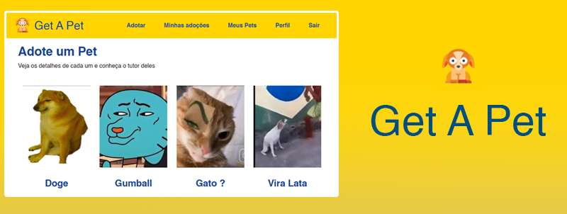
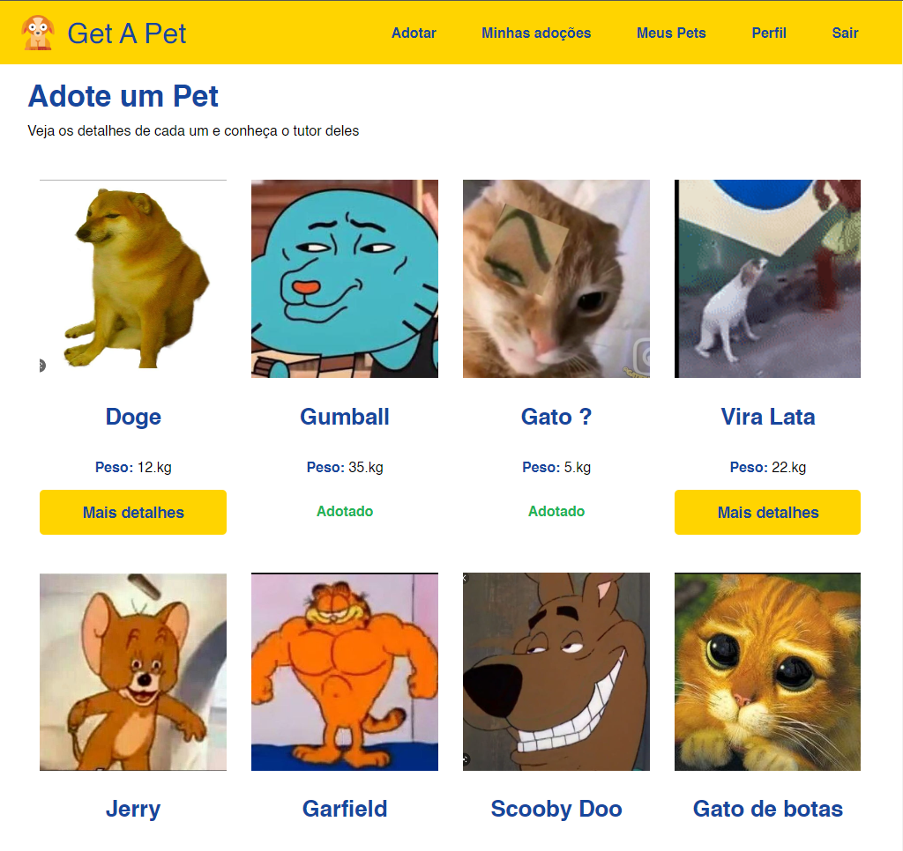
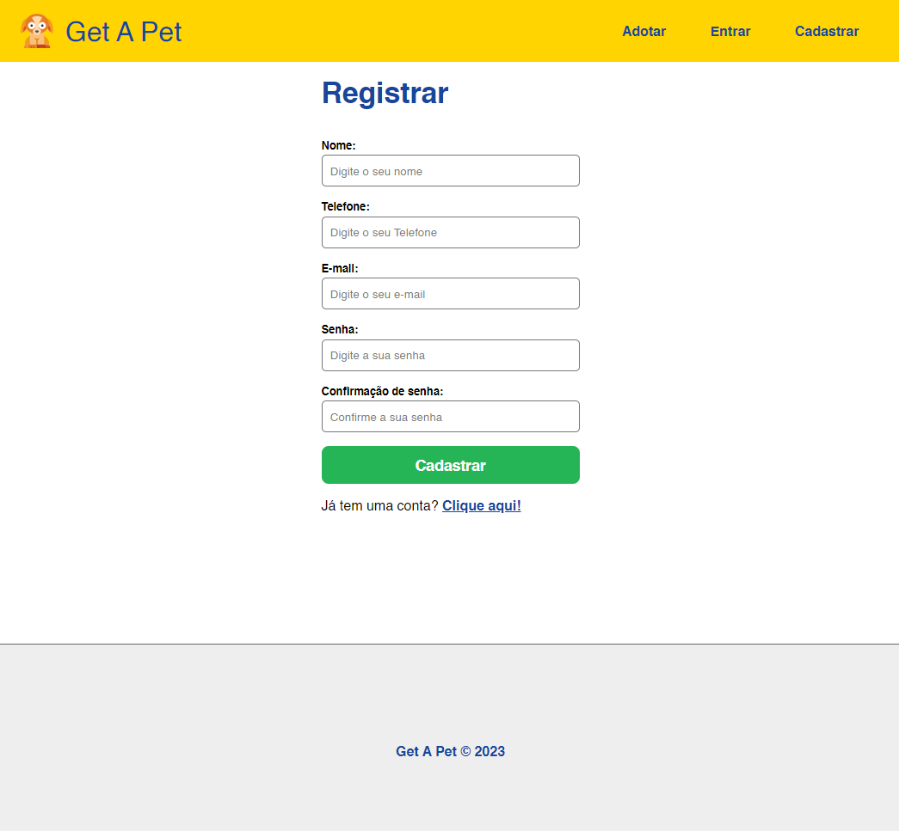
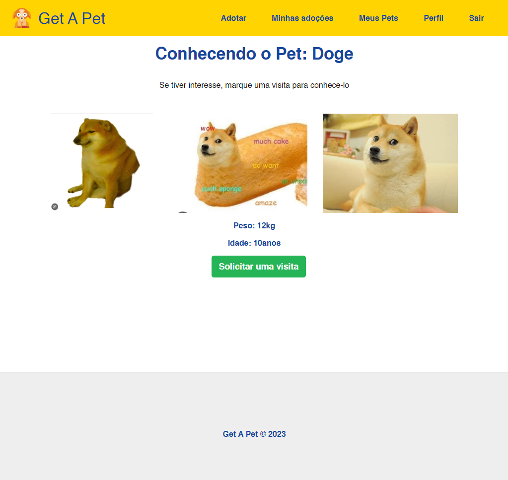
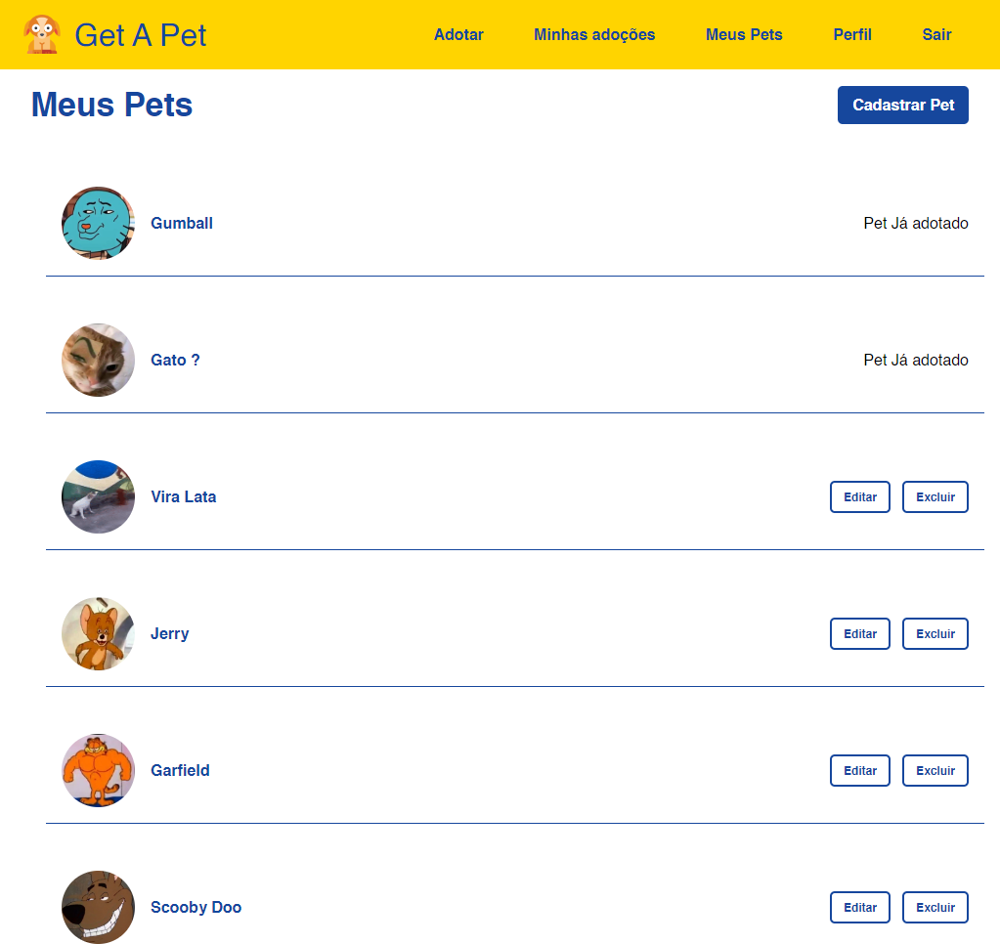
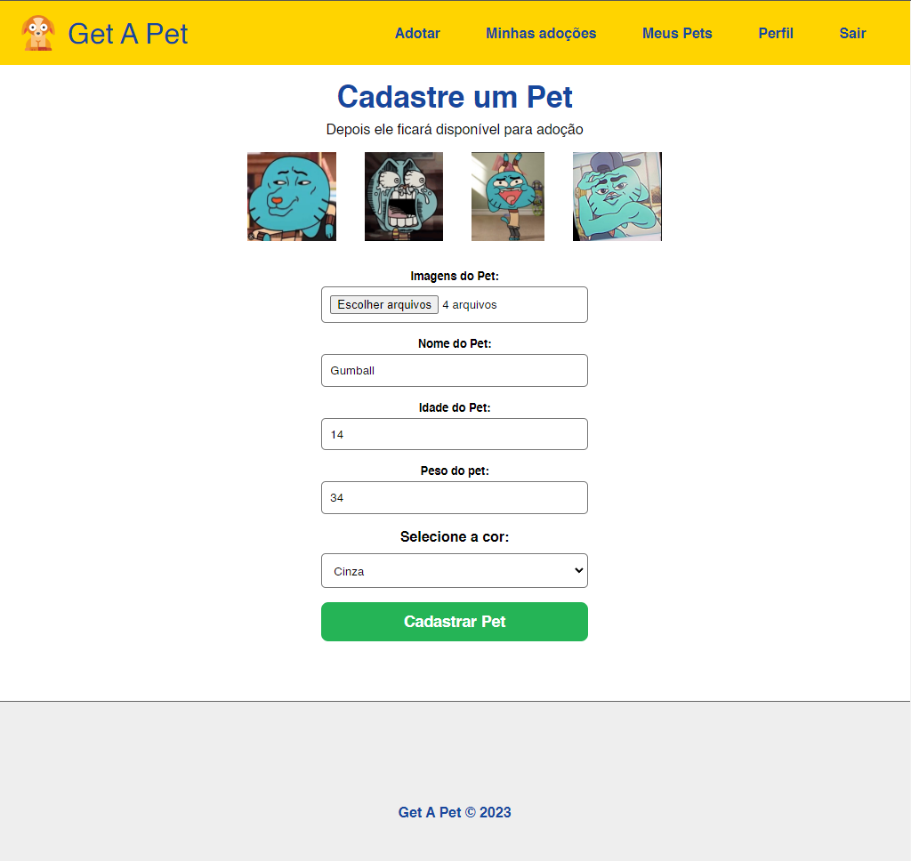
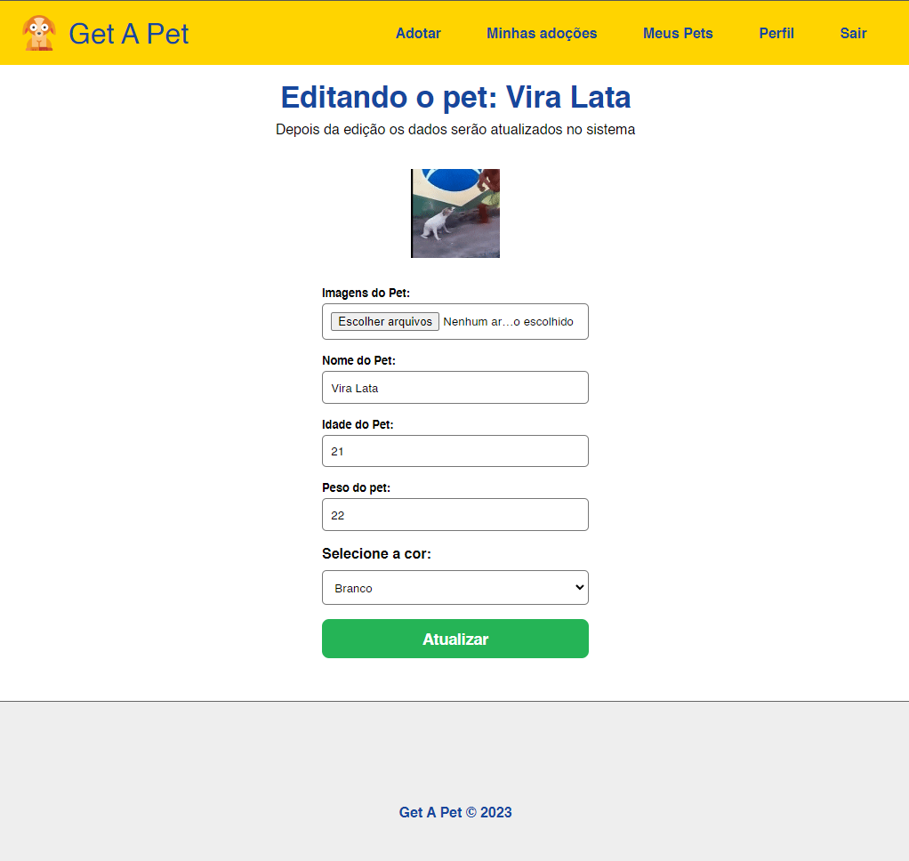
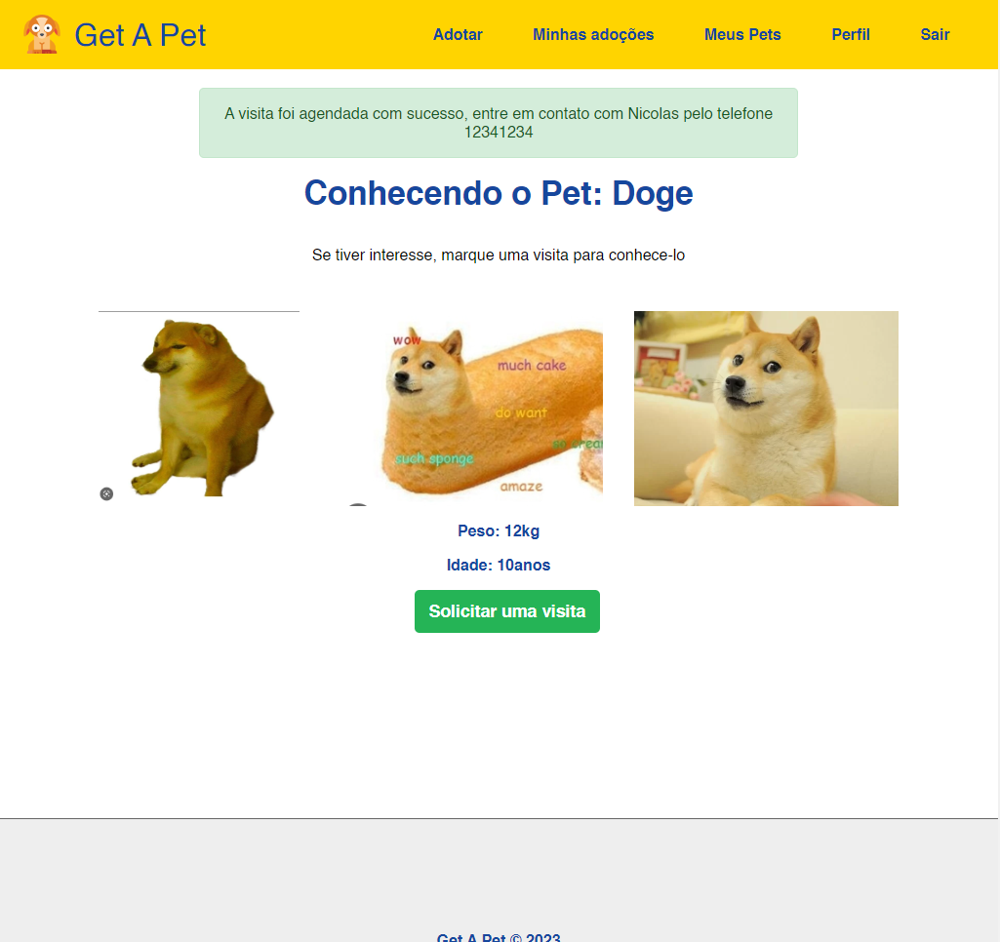

# Get A Pet - BackEnd
<h1 align="center"></h1>
Get A Pet é uma aplicação web que permite a adoção de animais de estimação. O objetivo deste projeto é consumir uma API de back-end para que permita que usuários cadastrem ou adotem animais de estimação.

⚠️ Este projeto faz parte do curso de <a href="https://www.udemy.com/course/nodejs-do-zero-a-maestria-com-diversos-projetos/">Node.js do Matheus Battisti!</a> 

## Tecnologias 👩‍💻

- Node.Js
- Express
- React
- Axios

## Funcionalidades 🛠️

- [x]  Criar conta de usuário
- [x]  Logar e deslogar
- [x]  Manter usuário logado
- [x]  Editar perfil
- [x]  Cadastrar pet
- [x]  Editar pet
- [x]  Excluir pet
- [x]  Exibir página de detalhes de outros pets
- [x]  Solicitar visita para outros pets
- [x]  Concluir processo de adoção dos pets

## Screenshots 📷

- HomePage
<h2 align="center"></h2>

- Register
<h2 align="center"></h2>

- PetDetails
<h2 align="center"></h2>

- Dashboard
<h2 align="center"></h2>

- Add Pet
<h2 align="center"></h2>

- Edit Pet
<h2 align="center"></h2>

- Schedule Pet
<h2 align="center"></h2>

## Como usar 🤔

1.  Clone o repositório: `git clone https://github.com/Moscarde/Toughts`
2.  Instale as dependências: `npm install`
3.  Execute o script: `npm start`
