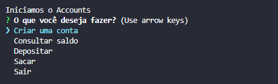

# accounts_nodejs
<h1 align="center"></h1>
CRUD de um simples sistema bancário feito em nodejs

## Funcionalidades 🛠️

- [x]  Criar contas
- [x]  Depositar valores em contas
- [x]  Sacar valores de contas
- [x]  Consultar o saldo

## Como usar 🤔

1.  Clone o repositório: `git clone https://github.com/Moscarde/accounts_nodejs`
2.  Instale as dependências: `npm install`
3.  Execute o script: `npm start`